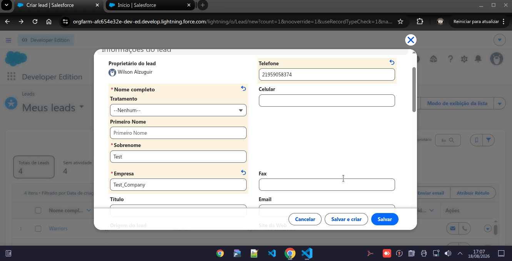

# Smart Lead Router

Automated lead scoring, enrichment, and assignment for Salesforce. When a Lead is created or updated, it's scored, classified as **Hot / Warm / Cold**, enriched with external company data, and routed to an owner — automatically, with no manual step. A Lightning Web Component surfaces the scored leads, hottest first.

> Built on Salesforce Developer Edition with Apex + LWC, following the trigger handler pattern with full test coverage including bulk (200-record) and async callout scenarios.



---

## What it does

- **Scores every lead** on creation and update, based on company size and contact completeness.
- **Classifies** each lead into Hot / Warm / Cold from its score.
- **Enriches** newly created leads asynchronously via a REST callout, filling in company size when missing, then re-scores automatically.
- **Assigns** an owner automatically (single-owner rule today, designed to evolve into round-robin / territory rules).
- **Displays** scored leads in a Lightning dashboard, sorted by score.

All of this runs inside the platform via an Apex trigger — the user just saves a lead.

## Scoring rules

Company-size points are **configuration, not code** — they live in a Custom Metadata Type (`Lead_Scoring_Rule__mdt`) so an admin can change the bands without a deploy:

| Rule (Custom Metadata record) | Min Employees | Max Employees | Points |
|---|---|---|---|
| Large | 501 | — | 60 |
| Medium | 100 | 500 | 40 |
| Small | 20 | 99 | 20 |

Contact points are still in code (simple, unlikely to change):

| Signal | Points |
|---|---|
| Email present | +20 |
| Phone present | +20 |

Classification thresholds: **Hot** ≥ 70 · **Warm** ≥ 40 · **Cold** < 40.

## Architecture

Trigger handler pattern, thin trigger delegating to testable service classes:

```
LeadTrigger
├─ before insert/update
│   └─ LeadTriggerHandler.handle(Trigger.new)
│        ├─ LeadScoringService.scoreLeads()      → queries Lead_Scoring_Rule__mdt, sets score + temperature
│        └─ LeadAssignmentService.assignLeads()  → sets OwnerId
└─ after insert
    └─ LeadTriggerHandler.enqueueEnrichment(Trigger.new)
         └─ LeadEnrichmentService (Queueable)     → REST callout, updates NumberOfEmployees,
                                                      triggers a rescore via a second `update`
```

Front-end:

```
leadScoreDashboard (LWC)
   └─ @wire → LeadDashboardController.getScoredLeads()  (@AuraEnabled cacheable)
```

### Key design decisions

- **Thin trigger, logic in services.** The trigger only detects the event and delegates.
- **Config-driven scoring.** Company-size bands live in `Lead_Scoring_Rule__mdt` records, queried once per transaction (cached in a static property on `LeadScoringService`) so bulk operations stay within one SOQL call regardless of batch size.
- **Callouts can't run synchronously in a trigger.** Enrichment is enqueued from `after insert` (once the Lead has an Id) and executes as a `Queueable` implementing `Database.AllowsCallouts`. It runs a normal `update` on the lead afterward, which re-triggers scoring — no duplicated logic.
- **Named Credential + External Credential** hold the callout endpoint and auth config, never hardcoded in Apex. Enrichment failures are caught and logged, never block the lead save — it's best-effort, not a hard dependency.
- **Bulkified.** Services operate on `List<Lead>`, never one record at a time. No SOQL or DML inside loops. Proven by a 200-record bulk insert test.
- **No hardcoded owner IDs.** Owner assignment resolves the running user via `UserInfo.getUserId()`, so the code works on any org.
- **Field-Level Security as code.** A permission set (`Lead_Scoring_Admin`) versions field access and the External Credential principal mapping, so a fresh deploy doesn't leave fields or callouts silently broken.

## Testing

| Test class | Covers |
|---|---|
| `LeadScoringServiceTest` | Hot / Warm / Cold scoring, unit-level |
| `LeadTriggerTest` | Full trigger flow on single insert + 200-record bulk insert |
| `LeadEnrichmentServiceTest` | Enrichment success path (score recalculates) + failure path (503 doesn't break the lead), using `HttpCalloutMock` |

The bulk test proves the trigger chain doesn't hit governor limits at scale. The enrichment failure test mirrors a real instability encountered integrating with the external test service during development — the lead must survive the callout provider being unreliable.

```bash
sf apex run test --class-names LeadScoringServiceTest --class-names LeadTriggerTest --class-names LeadEnrichmentServiceTest --result-format human --wait 10
```

## Project structure

```
force-app/main/default/
├── objects/
│   ├── Lead/fields/                      # Lead_Score__c, Lead_Temperature__c
│   └── Lead_Scoring_Rule__mdt/           # Custom Metadata Type definition
├── customMetadata/                       # Lead_Scoring_Rule.Large/Medium/Small records
├── classes/
│   ├── LeadScoringService.cls               # scoring logic, queries CMT rules
│   ├── LeadAssignmentService.cls             # owner assignment
│   ├── LeadEnrichmentService.cls             # async REST callout (Queueable)
│   ├── LeadEnrichmentMock.cls                # HttpCalloutMock for tests
│   ├── LeadTriggerHandler.cls                # orchestrates the services
│   ├── LeadDashboardController.cls           # @AuraEnabled data for the LWC
│   ├── TestDataFactory.cls
│   ├── LeadScoringServiceTest.cls
│   ├── LeadTriggerTest.cls
│   └── LeadEnrichmentServiceTest.cls
├── triggers/LeadTrigger.trigger
├── lwc/leadScoreDashboard/
├── namedCredentials/Company_Enrichment_API.namedCredential-meta.xml
├── externalCredentials/Company_Enrichment_Auth.externalCredential-meta.xml
└── permissionsets/Lead_Scoring_Admin.permissionset-meta.xml
```

## Setup

1. Authorize a Developer org:
   ```bash
   sf org login web --alias LeadRouter --set-default
   ```
2. Deploy the metadata:
   ```bash
   sf project deploy start --source-dir force-app/main/default
   ```
3. Assign the permission set so scoring fields and the enrichment callout are accessible:
   ```bash
   sf org assign permset --name Lead_Scoring_Admin
   ```
4. Add the `leadScoreDashboard` component to a Lightning page (App Builder), then create a Lead and watch it get scored, enriched, and (a few seconds later) rescored.

## Roadmap

- Round-robin / territory-based assignment instead of single owner.

---

Built as a portfolio project to demonstrate Apex architecture, trigger design, async processing, external integration, and test coverage — the core skills of a Salesforce developer.